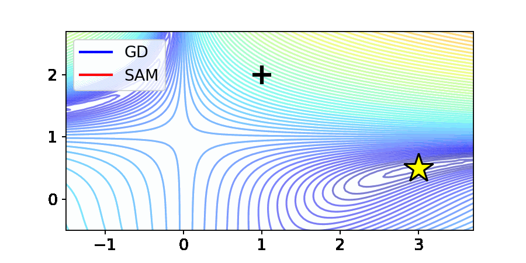

# 🎉 Stability Analysis of Sharpness-Aware Minimization (ICML 2026)

Official code for the paper **Stability Analysis of Sharpness-Aware Minimization** (Kim et al., Trustworthy AI Lab).

This repository reproduces the toy experiments and figures from the paper—Beale landscape trajectories (GD vs. SAM), gradient cosine plots, and the saddle-point demo \(f(x,y)=x^2-y^2\).



For background, motivation, and a full walkthrough of the results, see the lab articles:

- **English:** [Stability Analysis of Sharpness-Aware Minimization](https://trustworthyai.co.kr/article/2026/sam-eng/)
- **한국어:** [Stability Analysis of Sharpness-Aware Minimization](https://trustworthyai.co.kr/article/2026/sam/)

Paper PDF: [`https://icml.cc/virtual/2026/poster/61132`](https://icml.cc/virtual/2026/poster/61132)

## Setup

```bash
pip install -r requirements.txt
```

## Reproduce

```bash
python scripts/run_baseline.py   # Beale: GD + SAM (ρ ∈ {0, 0.1, 0.5, 1.0})
python scripts/run_sam_wp.py     # SAM ρ=0.5 (wp figure)
python scripts/plot_figures.py   # all figures
```

## Outputs

| File | Description |
|------|-------------|
| `intro.pdf` / `intro.gif` | Beale landscape: GD vs. SAM (ρ=0.5) |
| `grad_cos.pdf` | Cosine similarity of ascent vs. descent gradients |
| `wp.pdf` | SAM perturbation \(w^p_t\) near mid-training |
| `traj.pdf` | 3D saddle \(f(x,y)=x^2-y^2\): GD vs. SAM |

Cached `*.pt` files are gitignored; run the first two scripts before plotting.

## Structure

```
sam_stability/   # SAM optimizer, Beale experiment, plotting
scripts/         # run_baseline.py, run_sam_wp.py, plot_figures.py
```
